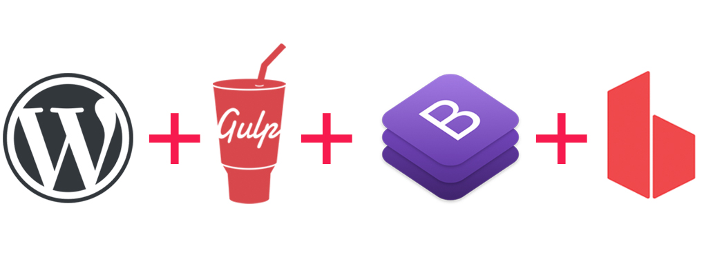

# WordPress + Gulp + BrowserSync + Bootstrap 4 

---
### WP Login:
- **User**: root
- **Pass**: password

### Requirements:
You have to install the following softwares on your machine to able to use this automation tool.
- [node.js](https://nodejs.org/en/) is a JavaScript runtime built on Chrome's V8 JavaScript engine.
- [npm](https://www.npmjs.com/) is node.js package manager for installing open-source JavaScript apps.

### Installation:
After downloading this repo, open `project-folder/wp-content/themes/BackBone/assets` directory within your terminal and run `npm install` command to install all the dependencies and to unlock all other available tasks.

| Command | Descriptions |
| ------------- | ------------- |
| `npm install`  | Installing all dependencies for this application  |
| `gulp sass`  | Compiling all SASS files into CSS  |
| `gulp css` | Minify + Combine + Adding Prefixes to CSS supporting major browsers  |
| `gulp js` | Combine and minify JS files  |
| `gulp img`  | Compress all PNG, JPG, GIF and SVG graphic files  |
| `gulp build`  | Build all the assets for production  |
| `gulp watch` | Constantly watching and reloading browser on changes to (SASS, CSS, JS and HTML) files  |
| `npm start` | Alternative command for `gulp watch` command  |
